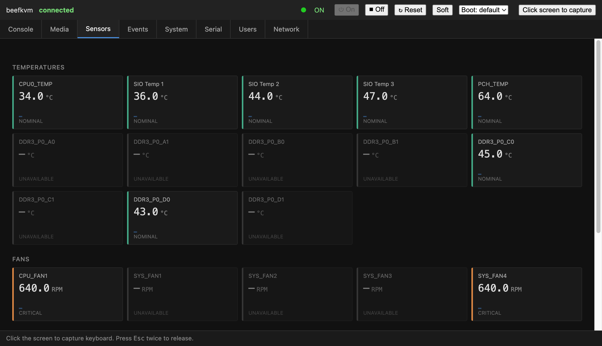
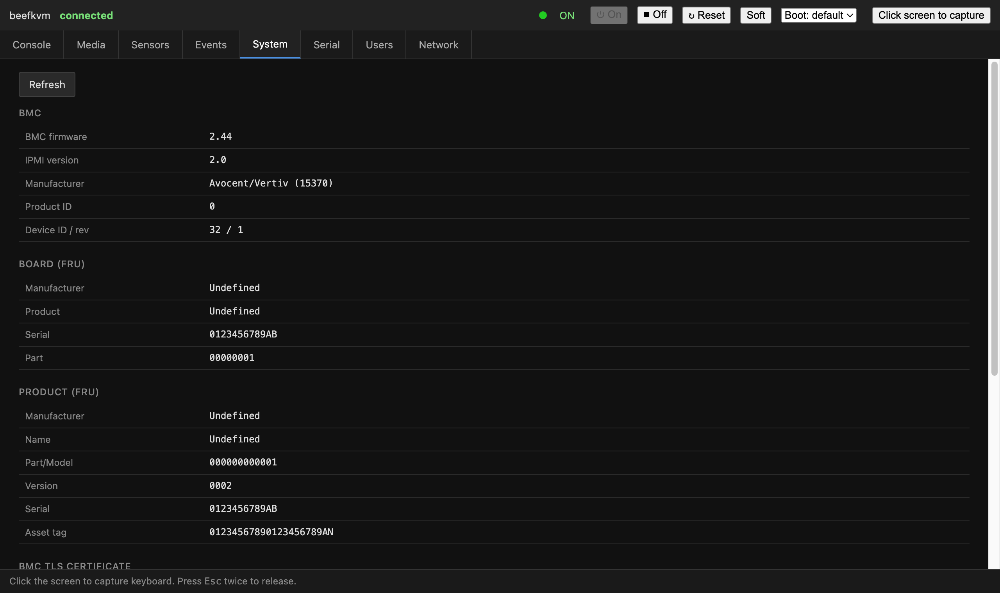

# beefkvm

[](https://github.com/zheng1/beefkvm/actions/workflows/ci.yml)
[](https://pkg.go.dev/github.com/zheng1/beefkvm)
[](LICENSE)

A browser-based KVM and management console for Avocent-style BMCs, in pure Go.

Named after the `0xBEEF` frame magic in the APCP/AVPT protocol it speaks.

## Why

Some server BMCs ship a remote console that is a **Java applet**. That applet
needs a JRE with `applet` support, TLS 1.0, SSLv3-era ciphers, and legacy
renegotiation. On any current OS and browser it simply does not launch — which
means perfectly good hardware becomes unmanageable, with no vendor fix coming.

`beefkvm` replaces it. It speaks the BMC's wire protocol directly and renders
the console in a normal browser tab:

- **No Java.** No applet, no JNLP, no bundled JRE, no native libraries.
- **No vendor binaries.** Nothing proprietary is redistributed here.
- **One static Go binary** plus a single embedded HTML page.

## What it does

| Area | Status |
|---|---|
| KVM video (custom DCT codec) | Working — full-rate, sharp text |
| Keyboard (USB HID) + auto-repeat | Working |
| Mouse (absolute) | Implemented; movement unverified (text-only test target) |
| Key macros: Ctrl+Alt+Del, Alt+Tab, Ctrl+Alt+F1–F6, sticky modifiers | Working |
| Clipboard paste into the console | Working |
| Virtual media (mount ISO / USB / floppy) | Working |
| Power on / off / reset / soft shutdown / cycle | Working (IPMI) |
| One-time boot device (PXE / CD / HDD / BIOS) | Working (IPMI) |
| Sensors (temps, fans, voltages) + live stream | Working (IPMI SDR) |
| System event log (view + clear) | Working (IPMI SEL) |
| System info: BMC firmware, IPMI version, FRU | Working |
| BMC TLS certificate inspection | Working |
| User management (add / edit / privilege / enable) | Working (IPMI) |
| Network config (read; guarded write) | Working (IPMI LAN) |
| Serial-over-LAN console | Working — see note below |
| Smart card (CAC/PIV) redirection | Plumbed; needs a PC/SC reader to exercise |
| Automatic reconnect on session drop | Working |

### Notes on the last three

- **Serial-over-LAN** activates and carries traffic, but SoL only transports
  what the *target OS* puts on the serial line. If the screen stays blank, the
  target has no serial console. On Linux:
  `systemctl enable --now serial-getty@ttyS0.service` and add
  `console=ttyS0,115200` to the kernel command line.
- **Smart card** redirection is wired end to end (PC/SC on macOS, status in the
  UI, APDU relay over the VM channel), but it has only been exercised as far as
  reader detection — no physical CAC/PIV reader was available. Treat it as
  untested against real cards.
- **Palette video tiles** are implemented and unit-tested, but the BMC used for
  development only ever emits DCT tiles, so that path has not run against live
  hardware.

## Screenshots

Sensors — live SDR readings over IPMI, streamed to the browser:



System — BMC firmware, FRU inventory, and TLS certificate details:



## Hardware support

### Verified working

Exactly one machine, tested end to end. This is the only configuration I can
personally vouch for:

| Property | Value |
|---|---|
| **Motherboard** | **GIGABYTE GA-6PXSV4** |
| BIOS | R21_NV (2017-11-21) |
| Chipset | Intel C600/X79 series (LPC `8086:1d41`) |
| CPU | Intel Xeon E5-2696 v2 (12C/24T, LGA2011) |
| Memory | 8× DDR3 slots, 4 channels (`DDR3_P0_A0`…`D1`); 2× 64 GB populated |
| BMC SoC | ASPEED AST2300-class, licensed Avocent KVM stack |
| BMC firmware | **2.44** |
| APCP server version | **2.34** |
| IPMI version | **2.0** |
| IPMI manufacturer ID | 15370 (GIGA-BYTE TECHNOLOGY) |
| IPMI device ID / rev | 32 / 1 |
| Board manufacture date | 2011-06-03 (per FRU) |
| Console resolution | 1024×768 |
| Video stream | DCT tiles, packet subtype 5 (mode 1, 16×16 MCU) |
| SoL | Enabled, channel 1, force-encryption on |

Note that the BMC's FRU is unpopulated (`Board Product: Undefined`), so beefkvm
cannot report the board model itself — the model above comes from the host's
SMBIOS. If your BMC has a properly filled FRU, the System tab will show it.

Verified on that machine: KVM video, keyboard (including auto-repeat, with
keystrokes confirmed on the target screen), key macros, clipboard paste,
virtual media, power control, one-time boot device, 28 sensors cross-checked
against `ipmitool`, SEL, user management, LAN config read, SoL activation, and
session auto-reconnect.

Mouse input is implemented and its frames are accepted by the BMC without
error, but the test target only ever showed a text console, so pointer
*movement* was never confirmed visually. If you run a graphical console,
mouse feedback is especially welcome.

### Likely to work (untested — reports wanted)

The reference machine is the clearest evidence for this: its BMC reports
**Gigabyte** as the manufacturer, yet the remote console it serves is
**Avocent's** Java client speaking APCP. In other words Avocent licensed this
KVM stack to board vendors, so the protocol shows up under many brands and the
BMC's own vendor ID tells you little about which wire format it speaks.

Further evidence that the protocol is shared, from the client JARs themselves:

- Both the generic Avocent KVM client and Dell's iDRAC6 client are
  `Built-By: Avocent Corporation` and share 245 identically-named classes,
  including the whole `com.avocent.kvm.a.a` codec package.
- The video decoder in both uses the **same integer IDCT constants**
  (362 / 473 / 277 / 669) and the same quantisation-table layout — the codec
  core this project reimplements.

So these are plausible targets, in rough order of confidence:

| Hardware | Basis | Status |
|---|---|---|
| Other **Gigabyte GA-6PXSV / GA-7PES** boards (LGA2011, C602/X79, AST2300) | Same vendor, BMC generation, and KVM stack as the verified GA-6PXSV4 | Untested |
| Dell **iDRAC6** (PowerEdge 11G: R610/R710/T610…) | Ships `avctKVM.jar` from the same Avocent codebase; identical IDCT constants | Untested |
| Avocent **MergePoint** service processors | Same product line as the tested unit | Untested |
| OEM AST2300/AST2400 boards licensing Avocent KVM (various whitebox/Supermicro-era boards) | Same SoC class and APCP server | Untested |
| Dell **iDRAC7/8** | Newer stack; KVM moved to a different transport | Unlikely without work |
| **iDRAC9**, modern AMI MegaRAC, Redfish-only BMCs | Different protocol entirely (HTML5/Redfish) | Out of scope |

Class-name overlap is strong evidence but not proof: the decoder classes differ
byte-for-byte between versions, so wire-level details may still diverge. Treat
the whole table as a hypothesis until someone reports back.

### Reporting your hardware

Whether it works or not, a report helps. Please open an issue with:

```sh
apcp-probe --host <bmc> --learn-pin     # cert pin + handshake info
ipmitool -I lanplus -H <bmc> -U <user> -P <pass> -C 3 mc info
```

plus your server model, BMC firmware version, and — if video is broken — the
`[avo] tile hdr:` lines from the beefkvm log. Those bytes identify the packet
subtype and codec mode, which is what determines whether the decoder needs
another path.

## Install

```sh
go install github.com/zheng1/beefkvm/cmd/beefkvm@latest
```

Or build everything from a checkout:

```sh
git clone https://github.com/zheng1/beefkvm
cd beefkvm
go build ./...
```

Go 1.26+. macOS and Linux. The smart-card backend uses cgo + PC/SC on macOS;
elsewhere it compiles to a no-op stub, so `CGO_ENABLED=0` builds are fine.

## Quick start

The BMC's certificate is self-signed (and on many units, long expired), so it
cannot be validated against a CA. `beefkvm` pins it instead. Learn the
fingerprint once:

```sh
apcp-probe --host bmc.example --learn-pin
```

Then start the console:

```sh
beefkvm \
  --host bmc.example \
  --user admin \
  --pass "$BMC_PASS" \
  --pin  "$BMC_PIN" \
  --ipmi-user admin --ipmi-pass "$BMC_PASS"
```

It prints a URL containing a one-time session token. Open it:

```
beefkvm: listening on http://127.0.0.1:8080?t=<token>
```

Credentials are also read from `BMC_HOST`, `BMC_USER`, `BMC_PASS`, `BMC_PIN`,
`BMC_IPMI_USER`, and `BMC_IPMI_PASS`, which keeps them out of your shell
history and process list.

Omit `--ipmi-user`/`--ipmi-pass` to run KVM-only; the power, sensor, event,
user, network, and serial features simply stay unavailable.

## Security posture

Please read this before exposing it to anything.

- **The web UI is plain HTTP and is meant to be local.** It defaults to
  `127.0.0.1`. Access is gated by a random 256-bit per-run token, carried in
  the URL and then a cookie, plus a same-origin check on the WebSocket.
- **A token in a URL is not a strong secret.** It can land in shell history,
  proxy logs, and browser history. If you bind to a LAN address with
  `--listen`, put it behind a TLS-terminating reverse proxy and your own
  authentication. There is no HTTPS, no session timeout, and no audit log yet.
- **Certificate pinning is the only transport authentication.** A pin mismatch
  aborts the connection. Learn the pin over a network you trust.
- **A BMC is total control of the machine** — power, boot device, virtual
  media, and keyboard. Anyone who reaches this UI has all of that. If your BMC
  still has vendor-default credentials, change them before anything else.

## Protocol notes

`docs/apcp-protocol.md` documents the wire format as observed: the AVPT/`BEEF`
framing, session types (KVM, virtual media, and the companion video channel),
the login handshake, and the video packet layout.

The video codec is not baseline JPEG. It is a custom DCT variant with a 4-bit
opcode stream, a 4-entry palette cache, its own quantisation tables, and an
integer AAN IDCT. `internal/video` implements it; the comments there record the
details that actually mattered — quantisation table ordering, tile raster
wrapping, and the per-frame ACK that keeps the stream alive.

## Tools

| Command | Purpose |
|---|---|
| `beefkvm` | The console: web UI + KVM + IPMI bridge |
| `apcp-probe` | Connect, learn the cert pin, inspect the handshake |
| `apcp-capture` | Record raw protocol frames for analysis |
| `beefkvm-vm` | Mount virtual media from the CLI |
| `beefkvm-power` | Power control from the CLI |
| `beefkvm-usb` | USB/HID experiments |

## Tests

```sh
go test ./...
```

Unit tests cover the codec, framing, and IPMI encoding, and run with no
hardware. Tests that need a live BMC are opt-in via environment variables, for
example:

```sh
IKVM_SOL_LIVE=1 SOL_HOST=bmc.example SOL_USER=admin SOL_PASS=secret \
  go test ./internal/ipmi -run TestSOLLive -v
```

Be aware that the live user-management test creates and then removes a
temporary account in an unused slot.

## Legal

This is an independent, clean-room-style reimplementation produced by observing
network traffic and behaviour, for the purpose of **interoperability** with
hardware the user already owns.

- No vendor source code, JARs, native libraries, or firmware is included in or
  distributed by this repository.
- Avocent, MergePoint, Vertiv, ASPEED, and any other names mentioned are
  trademarks of their respective owners, used here only to identify the
  hardware this software talks to. There is no affiliation or endorsement.
- To use this you need your own BMC and your own credentials.

## Contributing

The most useful contribution is a **hardware report** — beefkvm is verified on
exactly one machine, so telling us whether it works on yours (especially if it
doesn't) is worth more than any feature. See [CONTRIBUTING.md](CONTRIBUTING.md)
for that, for how to share captures without leaking hostnames or credentials,
and for the development workflow.

Please also read the [Code of Conduct](CODE_OF_CONDUCT.md).

## Security

Report vulnerabilities privately via
[GitHub's security advisories](../../security/advisories/new) rather than a
public issue — see [SECURITY.md](SECURITY.md), which also lists the known,
deliberate limitations that are *not* considered vulnerabilities.

## License

MIT — see [LICENSE](LICENSE).
